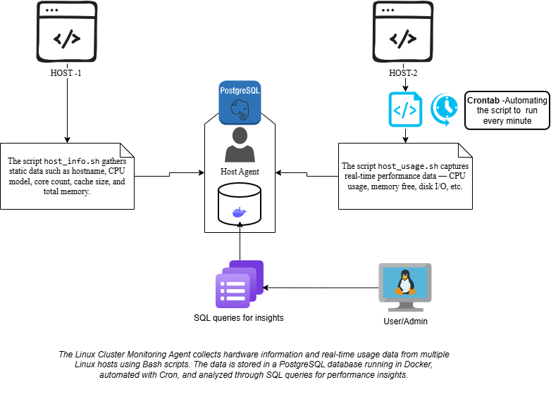

# Linux Cluster Monitoring Agent (LCA)

> A Bash- and Docker-based monitoring solution for Linux servers that collects hardware specifications and system usage data, storing them in a centralized PostgreSQL database.

## Table of Contents
- [Introduction](#-introduction)
- [Quick Start](#️-quick-start) 
- [Architecture](#-architecture)
- [Implementation](#-implementation)
- [Testing](#-testing)
- [Deployment](#-deployment)
- [Improvements](#-improvements)
- [Author](#-author)

## Introduction
The Linux Cluster Monitoring Agent (LCA) automates system monitoring across a cluster of Linux servers. It consists of two main Bash scripts that:
- Collect static hardware information (`host_info.sh`)
- Gather real-time usage data (`host_usage.sh`) 

Data is stored in a PostgreSQL database running in Docker, enabling DevOps teams to analyze infrastructure health and optimize resources.

**Technologies:** Bash, Docker, PostgreSQL, Git, Cron, Linux CLI

## Quick Start

```bash
# 1. Start PostgreSQL container
bash linux_sql/scripts/psql_docker.sh start

# 2. Create database and tables 
psql -h localhost -U postgres -f linux_sql/ddl.sql

# 3. Insert hardware info (once per server)
bash linux_sql/scripts/host_info.sh localhost 5432 host_agent postgres password

# 4. Insert usage data (manual)
bash linux_sql/scripts/host_usage.sh localhost 5432 host_agent postgres password

# 5. Schedule collection (every minute)
* * * * * bash /home/rocky/dev/jarvis_data_eng_SridharRaviKumar/linux_sql/scripts/host_usage.sh localhost 5432 host_agent postgres password >> /tmp/host_usage.log 2>&1
```

## Architecture
The LCA collects data from multiple Linux hosts and sends it to a centralized PostgreSQL instance running in Docker.



### Scripts Overview
| Script | Purpose | Description |
|--------|---------|-------------|
| psql_docker.sh | Database Setup | Manages PostgreSQL container lifecycle |
| host_info.sh | Hardware Collection | Gathers static server specifications |
| host_usage.sh | Usage Collection | Collects real-time resource metrics |
| crontab | Scheduling | Automates periodic data collection |
| queries.sql | Analytics | SQL queries for performance analysis |

### Database Schema

**host_info Table:**
| Column | Type | Description |
|--------|------|-------------|
| id | SERIAL PRIMARY KEY | Host identifier |
| hostname | VARCHAR | Server FQDN |
| cpu_number | INT | CPU core count |
| cpu_architecture | VARCHAR | CPU architecture |
| cpu_model | VARCHAR | CPU model name |
| cpu_mhz | DECIMAL | CPU frequency |
| l2_cache | INT | L2 cache size (KB) |
| total_mem | INT | Total memory (MB) |
| created_at | TIMESTAMP | Record timestamp |

**host_usage Table:**
| Column | Type | Description |
|--------|------|-------------|
| timestamp | TIMESTAMP | Collection time |
| host_id | INT (FK) | References host_info.id |
| memory_free | INT | Available memory (MB) |
| cpu_idle | INT | CPU idle percentage |
| cpu_kernel | INT | Kernel CPU usage (%) |
| disk_io | BIGINT | I/O operations count |
| disk_available | INT | Free disk space (MB) |

## Testing
- Validated PostgreSQL container deployment
- Verified database schema creation
- Tested data collection scripts
- Confirmed Cron job scheduling
- Validated data integrity through SQL queries

## Deployment
- Docker container for PostgreSQL
- Bash scripts distributed across hosts
- Cron-based automation
- GitHub for version control

## Improvements
1. Implement alerting system
2. Create visualization dashboard
3. Add data retention policies
4. Enhance security measures
5. Integrate CI/CD pipeline

## Author
Sridhar Ravi Kumar  
Data Engineering Trainee - Jarvis Consulting Group  
Ontario, Canada
