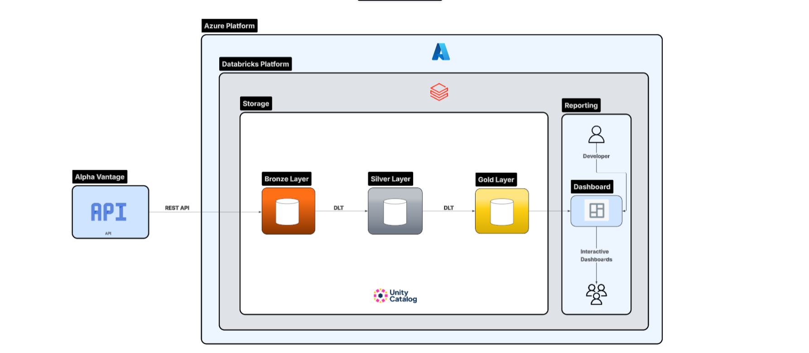
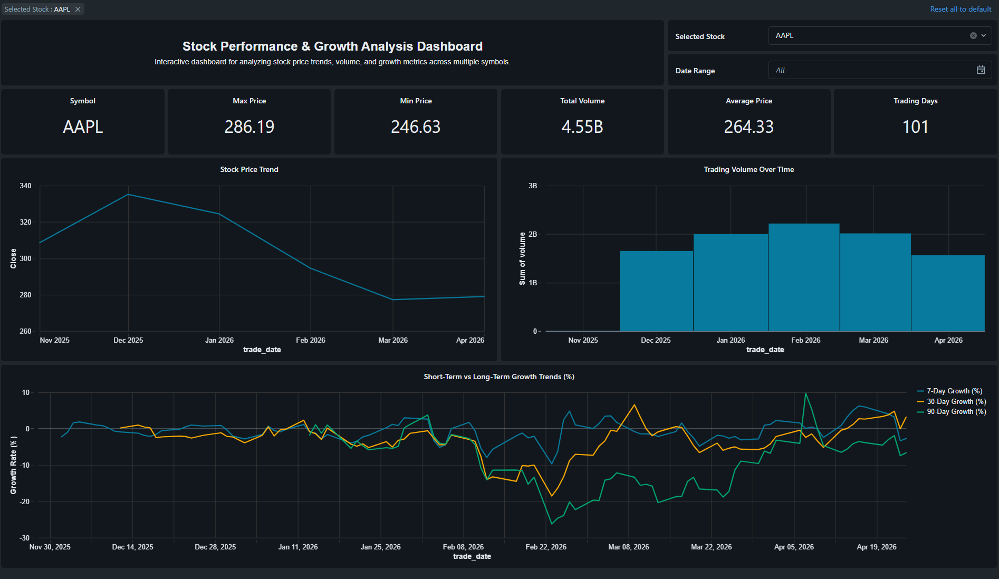

# Stock Data Pipeline using Databricks (DLT)

## Overview

This project is a simple end-to-end data pipeline built using Databricks. It pulls stock market data from an external API, processes it using Delta Live Tables (DLT), and presents the results in an interactive dashboard.

The goal of this project was to understand how real-world data pipelines are built — from ingestion to transformation to visualization and automation.

---

## What this project does

- Fetches daily stock data from Alpha Vantage API
- Stores raw data as JSON files in a Unity Catalog Volume
- Processes data using a medallion architecture:
  - Bronze (raw data)
  - Silver (cleaned and structured data)
  - Gold (aggregated and analytical data)
- Builds a dashboard to visualize:
  - Price trends
  - Trading volume
  - Growth metrics (7, 30, 90 days)
- Automates the entire workflow using Databricks Jobs

---

## Architecture

API → Volume (raw JSON) → DLT Pipeline → Bronze → Silver → Gold → Dashboard → Job

---

## Technologies used

- Databricks (Delta Live Tables, Jobs, Dashboard)
- Python
- SQL
- Alpha Vantage API

---

## Project structure

dlt_pipeline/
│
├── notebooks/
│ └── 01_ingest_api.py
│
├── pipelines/
│ └── dlt.py
│
├── sql/
│ └── validation_queries.sql
│
├── dashboard/
│ └── screenshots/
│
└── README.md

---

## Data layers

### Bronze
- Stores raw JSON data exactly as received from the API
- No transformations applied

### Silver
- Parses and flattens the JSON structure
- Extracts useful fields like:
  - symbol
  - trade_date
  - open, close, volume
- Converts data into a clean table format

### Gold
- Provides business-level insights:
  - Summary metrics (avg, max, min, total volume)
  - Price trends over time
  - Growth rates (7-day, 30-day, 90-day)

---

## Dashboard

## Dashboard Preview

The dashboard allows users to:

- View stock performance over time
- Analyze trading volume
- Compare growth across different time windows
- Filter by stock symbol and date range

---

## Automation

A Databricks Job is used to automate the workflow:

1. Run ingestion notebook
2. Run DLT pipeline
3. Refresh dashboard

This job is scheduled to run daily.

---

## What I learned

- How to build a structured data pipeline using DLT
- Importance of separating raw, clean, and analytical data
- How to work with APIs and JSON data
- How to debug pipeline and job execution issues
- How to present data through dashboards in a meaningful way

---

## Note

API keys are not included in this repository. Replace with your own key before running the project.

---

## Author

Sridhar R