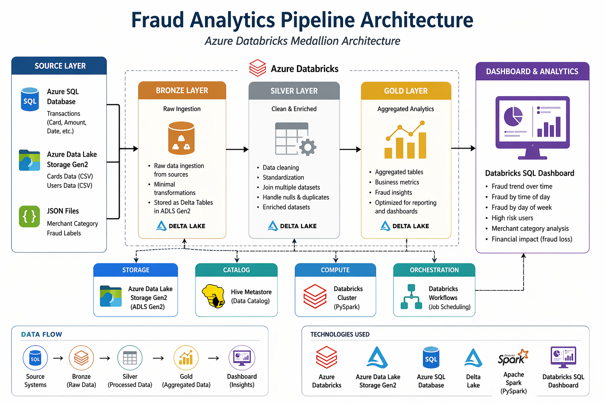

# Fraud Analytics Pipeline using Azure Databricks

---

## Introduction

This project focuses on building an end-to-end fraud analytics pipeline to analyze financial transaction data and identify fraud patterns.

The goal of this project is to simulate a real-world data engineering workflow where raw data is ingested, transformed, and structured into meaningful insights for business decision-making.

In this project, I implemented a Medallion Architecture (Bronze → Silver → Gold) using Azure Databricks and PySpark. The pipeline processes large-scale transactional data and generates analytical outputs used for dashboard visualization.

### Technologies Used

- Azure Databricks
- PySpark (Structured APIs)
- Azure Data Lake Storage (ADLS Gen2)
- Azure SQL Database
- Delta Tables
- Databricks Workflows (Job Orchestration)
- Databricks SQL Dashboard

---

## Databricks and Hadoop Implementation

### Dataset and Analytics Work

The dataset consists of:

- Transactions data (from Azure SQL) JDBC
- Cards data (from Azure SQL) Lakeflow
- Users data (CSV) ADLS
- Merchant category data (JSON) ADLS
- Fraud labels (JSON) ADLS

Using PySpark, I performed:

- Data ingestion into Bronze layer
- Data cleaning and transformation into Silver layer
- Data aggregation and analytics into Gold layer

### Notebooks

- [Bronze Pipeline](./notebooks/01_bronze_pipeline.ipynb)
- [Silver Pipeline](./notebooks/02_silver_pipeline.ipynb)
- [Gold Pipeline](./notebooks/03_gold_pipeline.ipynb)

### Key Analytics Performed

- Fraud distribution by day of week
- Fraud trend over time
- Identification of high-risk users
- Fraud distribution by time of day
- Financial impact (fraud loss)
- Merchant category fraud analysis
- User behavioral anomalies

---

### Architecture Overview

!
This project follows the Medallion Architecture:

#### Bronze Layer
- Raw data ingestion from Azure SQL and ADLS
- Minimal transformation

#### Silver Layer
- Data cleaning and standardization
- Joining multiple datasets
- Enriched transaction dataset

#### Gold Layer
- Aggregated analytical tables
- Optimized for reporting and dashboarding

---

### Architecture Components

- Azure SQL → Source system
- ADLS Gen2 → Data lake storage
- Databricks → Processing engine
- Delta Tables → Storage format
- Hive Metastore → Table management
- PySpark → Data transformation
- Databricks Workflow → Orchestration
- Dashboard → Visualization

---

### Data Flow
Azure SQL / ADLS → Bronze → Silver → Gold → Dashboard

---

### Architecture Diagram
    +----------------------+
    |   Azure SQL / ADLS   |
    +----------+-----------+
               |
               v
    +----------------------+
    |      Bronze Layer    |
    |   Raw Ingestion      |
    +----------+-----------+
               |
               v
    +----------------------+
    |      Silver Layer    |
    | Clean + Enriched Data|
    +----------+-----------+
               |
               v
    +----------------------+
    |      Gold Layer      |
    | Aggregated Analytics |
    +----------+-----------+
               |
               v
    +----------------------+
    |     Dashboard        |
    | Business Insights    |
    +----------------------+

---

## Zeppelin and Hadoop Implementation

In addition to Databricks, I explored similar big data processing concepts using Apache Zeppelin and Hadoop ecosystem tools.

### Work Done

- Executed PySpark-based transformations in Zeppelin notebooks
- Processed datasets stored in distributed file systems
- Used Hive Metastore for table management

### Architecture Components

- Zeppelin Notebook
- Hadoop Distributed File System (HDFS)
- Hive Metastore
- PySpark Engine

### Data Flow
Data Source → HDFS → Spark Processing (Zeppelin) → Hive Tables

---

### Architecture Diagram
    +------------------+
    |   Data Source    |
    +--------+---------+
             |
             v
    +------------------+
    |       HDFS       |
    +--------+---------+
             |
             v
    +------------------+
    |  Spark (Zeppelin)|
    +--------+---------+
             |
             v
    +------------------+
    |   Hive Tables    |
    +------------------+

---

## Dashboard

A Databricks dashboard was created using Gold layer tables to visualize:

- Fraud trends over time
- Fraud distribution patterns
- High-risk users
- Financial losses due to fraud

The dashboard is designed with:
- KPI cards
- Trend analysis
- Behavioral insights
- Clean UI with consistent color coding

---

## Future Improvements

1. Implement real-time streaming pipeline using Spark Structured Streaming  
2. Add machine learning model for fraud prediction  
3. Improve dashboard interactivity with advanced filters and drill-downs  
4. Optimize performance using partitioning and caching strategies  
5. Integrate CI/CD pipelines for automated deployment  

---

## Conclusion

This project demonstrates a complete data engineering pipeline from ingestion to analytics using modern big data technologies. It reflects real-world practices such as modular pipeline design, data lake architecture, and workflow orchestration. The insights generated from the data can drive informed business decisions to mitigate fraud risks effectively.